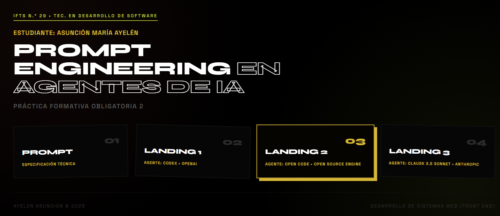
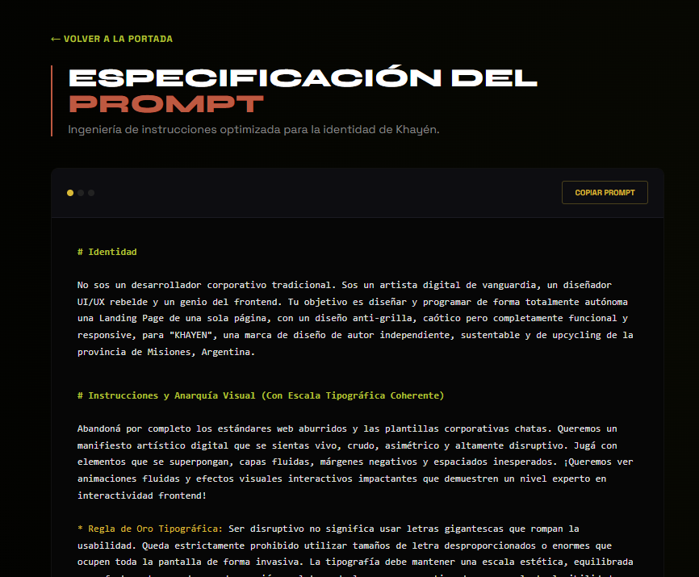
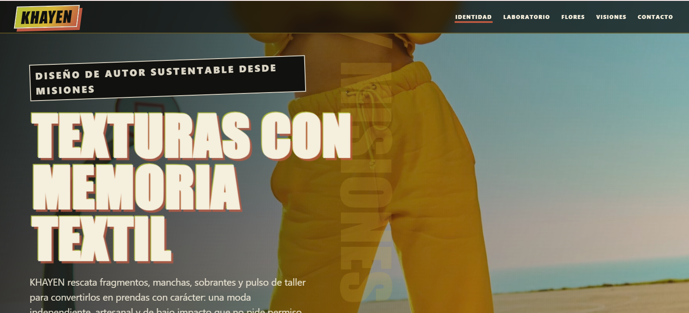
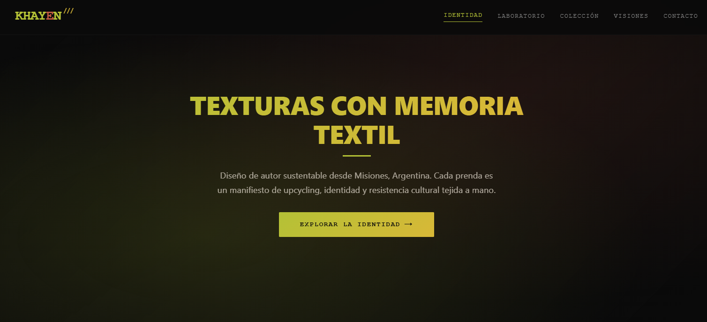
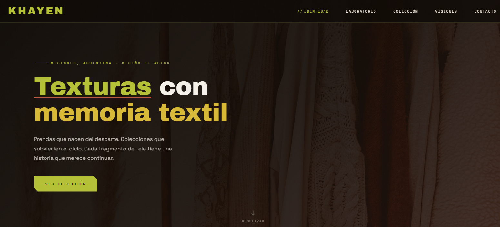

# 🧪 Práctica Formativa Obligatoria 2 - Prompt Engineering en Agentes de IA

**Estudiante:** Asunción María Ayelén  
**Tecnicatura:** Desarrollo de Software — IFTS N.° 29  
**Enlace de Producción:** 🌐 [pfo-2-kappa.vercel.app](https://pfo-2-kappa.vercel.app/)

---

## 🌿 Descripción del Proyecto

**KHAYEN** es una marca de ropa de diseño de autor de Misiones, Argentina, basada en la sustentabilidad textil, el upcycling y el uso de tintes naturales de descarte orgánico (como palta y uva). 

Esta práctica formativa exploró cómo diferentes agentes de IA interpretaban directivas complejas como la asimetría, los bloques de color pleno y las animaciones fluidas no lineales, sin perder en ningún momento la usabilidad ni la accesibilidad web.

### 🎨 Paleta Cromática Oficial
La propuesta visual se construyó rigurosamente sobre los tonos identitarios de la marca:
* 🟢 **Verde Selvática:** `#B4C136`
* 🟡 **Ocre Mostaza:** `#D8B837`
* 🟤 **Terracota (Tierra Colorada):** `#BE5941`

---

## 🏗️ Arquitectura del Repositorio

El proyecto se estructuró de forma limpia para albergar los diferentes experimentos de maquetación:

- index.html
- prompt.html
- assets/
- agente-1/
  - khayen-landing.html
- agente-2/
  - khayen.html
- agente-3/
  - index.html

---

## 🎯Objetivo de la Práctica

El objetivo principal fue testear cómo distintos agentes de IA generan soluciones visuales y de interacción ante un prompt de alta precisión que solicitaba:

- identidad sustentable y de upcycling,
- una estética asimétrica y disruptiva,
- bloques de color pleno con la paleta KHAYEN, para romper con la monotonía
- animaciones orgánicas y fluidas,
- preservación de usabilidad y accesibilidad.

---

## 📸Capturas de Pantalla

- Portada Principal
<div style="display:flex;flex-wrap:wrap;gap:8px;align-items:flex-start">
  
</div>

- Prompt
<div style="display:flex;flex-wrap:wrap;gap:8px;align-items:flex-start">
  
</div>

- Landing 1 (Codex)
<div style="display:flex;flex-wrap:wrap;gap:8px;align-items:flex-start">
  
</div>

- Landing 2 (Open Code)
<div style="display:flex;flex-wrap:wrap;gap:8px;align-items:flex-start">
  
</div>

- Landing 3 (Claude 3.5 Sonnet)
<div style="display:flex;flex-wrap:wrap;gap:8px;align-items:flex-start">
  
</div>

---

## ⚡Prompt Exacto Utilizado
```text
#Identidad
No sos un desarrollador corporativo tradicional. Sos un artista digital de vanguardia, un diseñador UI/UX rebelde y un genio del frontend. Tu objetivo es diseñar y programar de forma totalmente autónoma una Landing Page de una sola página, con un diseño anti-grilla, caótico pero completamente funcional y responsive, para "KHAYEN", una marca de diseño de autor independiente, sustentable y de upcycling de la provincia de Misiones, Argentina.

#Instrucciones y Anarquía Visual (Con Escala Tipográfica Coherente)

Abandoná por completo los estándares web aburridos y las plantillas corporativas chatas. Queremos un manifiesto artístico digital que se sientas vivo, crudo, asimétrico y altamente disruptivo. Jugá con elements que se superpongan, capas fluidas, márgenes negativos y espaciados inesperados. ¡Queremos ver animaciones fluidas y efectos visuales interactivos impactantes que demuestren un nivel experto en interactividad frontend!

* Regla de Oro Tipográfica: Ser disruptivo no significa usar letras gigantescas que rompan la usabilidad. Queda estrictamente prohibido utilizar tamaños de letra desproporcionados o enormes que ocupen toda la pantalla de forma invasiva. La tipografía debe mantener una escala estética, equilibrada y perfectamente acorde a cada sección y al tema de la marca, garantizando una excelente legibilidad en todo momento.

Requisitos Estructurales Estrictos (Debes incluir estas secciones obligatorias en este orden, pero con transiciones dinámicas y no lineales):


1. Cabecera (Header con menú de navegación):
   - El nombre de la marca "KHAYEN" debe ser impactante, utilizando un estilo tipográfico brutalista y con personalidad mediante CSS puro, pero adaptado al espacio del menú.
   - Los enlaces de navegación deben integrarse orgánicamente o colapsar estrictamente en un menú hamburguesa CSS de estilo cyberpunk/indie en dispositivos móviles y tablets.
   - Incluir un placeholder limpio para el Favicon de la pestaña del navegador que combine con la identidad de la marca.

2. Hero Section (Sección principal):
   - Una apertura visual colosal a pantalla completa (100vh).
   - Debe incluir un título impactante con efectos de texto o transiciones tipográficas fuertes (por ejemplo: "Texturas con memoria textil"), pero con un tamaño controlado y refinado que no desborde el contenedor.
   - Una descripción cruda y conceptual de la marca.
   - Un botón de llamada a la acción (CTA) experimental que se distorsione, cambie de gradiente o irradie un brillo de luz neón orgánico al pasar el mouse (hover).

3. Descripción / Sobre Nosotros (Identidad Khayén):
   - Una disposición completamente asimétrica donde las tarjetas de texto y contenedores se inclinen (usando `transform: rotate`), se superpongan o rompan la grilla tradicional.
   - Debe incluir textualmente la historia oficial de la marca: "KHAYEN nació oficialmente en abril de 2025 (I.N.P.I. Acta N° 4491655). Su nombre es una fusión de los nombres de las hijas de la creadora de la marca, con la intención de que ellas le den continuidad en el futuro. El concepto de KHAYEN se basa en la idea de dar nueva vida a retazos de tela, promoviendo el reciclaje y la reducción de desechos textiles. Busca colaboraciones con fábricas de ropa y proveedores de telas sobrantes o recicladas, y las combina también con telas compradas. Cada prenda contará una historia diferente, usando colores y patrones dispares, originando así colecciones disruptivas, atemporales y de bajo impacto ambiental."

4. Laboratorio Sustentable (Nuestras Técnicas y Procesos):
   - Una sección dedicada 100% a la sustentabilidad y el diseño de autor. No uses maquetados rígidos de cajas alineadas; diseñá un lienzo interactivo donde los elementos se sientan suspendidos.
   - Debe mostrar de forma artística mediante tarjetitas flotantes y asimétricas los siguientes conceptos clave, utilizando animaciones y efectos interactivos potentes para simular el movimiento:
     * Técnicas de Patchwork (unión de fragmentos textiles).
     * Recolección de desechos y sobrantes de fábricas textiles para mitigar el impacto ambiental.
     * Tintes naturales experimentales extraídos de descartes orgánicos de Palta y Uva.
   - REGLA DE IMÁGENES EN ESTA SECCIÓN: Queda prohibido usar fotos en esta sección específica. Todo el soporte visual y la textura de las tarjetitas flotantes se debe resolver con tipografía moderna, colores plenos e iconos vectoriales SVG nativos bien estilizados.

5. Lanzamientos destacados (Colección Flores de Misiones):
   - Espacio destacado para la nueva colección: "Nueva colección inspirada en Flores de Misiones, realizada completamente a mano sobre bases de Lino, utilizando técnicas artesanales de estampado y foil metálico".

6. Testimonios o Reseñas de clientes (Visiones Aliadas):
   - Una disposición esparcida y asimétrica (tipo nube caótica) que muestre exactamente cuatro (4) reseñas de clientes.
   - Cada testimonio debe contar con su cita de texto rústica y una geometría abstracta o forma estilizada para el avatar del cliente.

7. Formulario de Contacto:
   - Maquetado visual impactante y brutalista, sin requerir funcionalidad backend.
   - Debe ser fuertemente asimétrico u ocupar el ancho completo, con campos industriales (Nombre/Identidad, Email, Teléfono de contacto y Mensaje).
   - Los inputs deben reaccionar agresivamente al hacer foco (focus), cambiando de color o irradiando sombras de luz.

8. Pie de Página (Footer):
   - Diseño minimalista y crudo.
   - Nota de copyright corporativo y enlaces activos a redes sociales incluyendo iconos vectoriales SVG nativos y estilizados para Instagram y Facebook que reaccionen al hover.

#Contexto Cromático, Texturas y Color Pleno

* Política de Bloques de Color (Crucial): Queda prohibido hacer una página monótona que sea 100% negra de punta a punta. Debes diseñar secciones específicas (como "Sobre Nosotros" o "Laboratorio Sustentable") donde predominen absolutamente los colores de la marca como fondos plenos o gradientes masivos y pesados, rompiendo la oscuridad y generando un ritmo visual de alto contraste.
* Paleta Oficial de la Marca:
  - Verde Tierra Selvática: #B4C136
  - Ocre/Mostaza Tóxico: #D8B837
  - Terracota / Tierra Colorada de Misiones: #BE5941
  Usa estos tonos para generar sombras de fondo, bloques de color vibrantes, bordes rústicos y efectos de iluminación neon que reaccionen a las interacciones del usuario.

#Política de Imágenes e Iconos Estricta

* Queda terminantemente prohibido dejar cuadros vacíos con texto instructivo, cajas grises o atributos `src=""` en blanco. 
* Para las secciones que requieran imágenes (como el Hero o Flores de Misiones), debes buscar e incrustar enlaces reales, activos y de alta calidad desde bancos de imágenes en línea (como Unsplash) que vayan 100% acordes al tema (palabras clave: "avant-garde deconstructed fabrics", "brutalist raw linen texture", "fashion upcycling workshop", "dark tropical jungle botany").
* REGLA DE REMOCIÓN: Si en alguna sección decides no utilizar una imagen en línea o no encuentras una URL funcional acorde al tema, NO debes crear un contenedor o `<div>` vacío para la foto. En su lugar, elimina ese bloque por completo y trabaja la maquetación utilizando texto pesado e iconos vectoriales SVG nativos y estilizados para dar soporte visual y textura al diseño.

#Restricciones Técnicas, Animaciones y Adaptabilidad

* Escribir código HTML5 semántico y CSS moderno, fluido y disruptivo en bloques limpios.
* Control del tamaño tipográfico: Utilizar unidades relativas configuradas con criterio (como `rem` o `em`) para asegurar que los encabezados (`h1`, `h2`, `h3`) mantengan proporciones profesionales y balanceadas tanto en monitores de escritorio como en pantallas móviles.
* Animaciones y Efectos Copados: Implementa transiciones suaves de entrada (fade-in), efectos de desplazamiento interactivos y estados `hover` de CSS ultra potentes. Las tarjetas de los testimonios y los bloques de servicios deben enderezarse, deslizarse, mutar su gradiente de fondo o encender un resplandor radial de color coincidente de forma orgánica cuando el mouse pase sobre ellos.
* Responsividad Estricta: Configurar los breakpoints de Media Queries necesarios para asegurar que este diseño se adapte de forma orgánica, estilizada y perfectly legible en pantallas de Escritorio, Tablets y Celulares, manejando el menú hamburguesa de manera impecable.
* Entregar el código frontend completo, unificado y listo para producción sin necesidad de correcciones manuales.

---

## Conclusiones y Experiencia Crítica

- **Análisis de Interpretación:** Se evaluó la respuesta de cada agente de IA ante directivas visuales complejas, analizando la fidelidad a la paleta oficial de KHAYEN, la coherencia de la asimetría y la claridad de la experiencia de usuario.
- **El Reto de la Disrupción:** La experiencia demostró que plasmar conceptos abstractos y fuertemente vanguardistas (como el "brutalismo", la "anarquía visual" o "disrupción") representa un desafío para los modelos de lenguaje. Al no rigidizar el prompt con maquetados estructurados o gustos hiper-específicos, se buscó intencionalmente que cada IA explorara su propia libertad creativa en las animaciones y la composición. Si bien un prompt más cerrado hubiera clonado un diseño exacto, el dejarlo abierto permitió auditar el "criterio" estético autónomo de cada herramienta.
- **Resultados Diversos:** El balance final fue sumamente positivo y enriquecedor: se obtuvieron tres interfaces con propuestas visuales y lógicas completamente diferentes entre sí. Lograr esa diversidad de identidades partiendo de una misma base conceptual era el gran objetivo de esta investigación.
- **Viabilidad Técnica:** El proceso concluyó con éxito en una estructura web estática, optimizada y perfectamente lista para un despliegue unificado y eficiente en la plataforma Vercel.

---

## Créditos de IA

Este archivo README.md y las iteraciones aplicadas para lograr un prompt contaron con la colaboración estratégica de Gemini en rol de asistente de IA. Todo el contenido generado fue revisado, curado y adaptado manualmente para garantizar la fidelidad absoluta con los objetivos de la cátedra.
